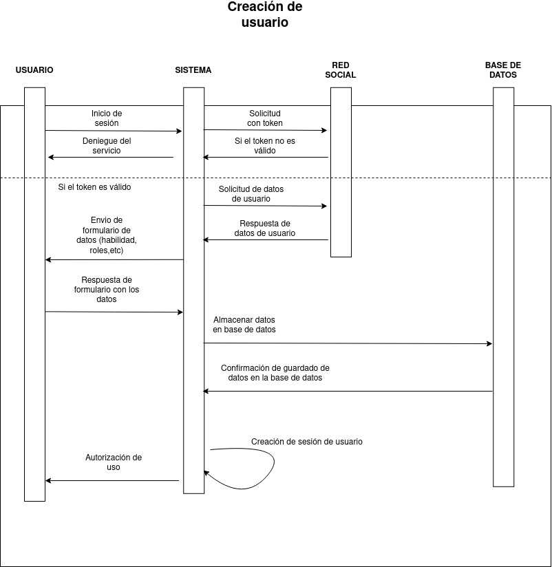

# WPparcial1

# Descripción del proyecto
Sistema diseñado para la gestión de proyectos de desarollo de software, a través de este proyecto una empresa podrá gestionar sus proyectos mediante metodologia agil SCRUM. En esta primera fase de proyecto se han agregado las rutas que se utilizaran en base a los diagramas de clases y al modelo REST.

# Diagrama de clases

# Diagrama de interacción
El diagrama de interaccion lo dividimos en varios para poder poder tener un mejor manejo de estos.

El diagrama de creación de usuario

El diagrama de inicio de sesión

El diagrama de creación de proyecto

El diagrama de uso de tablero de control

Aqui lo dividimos en scrum también ya que al ser scrum tienes más privilegios

# Herramientas utilizadas
-Express con el modelo de vistas PUG
-Node.js

# Estructura del Proyecto
public/: Carpeta que contiene archivos estáticos como CSS, JavaScript e imágenes.

views/: Contiene los archivos Pug para las vistas, organizados por categoría.

routes/: Definición de las rutas del proyecto.

controllers/: Controladores para gestionar las acciones y la lógica en base al modelo REST.

app.js: Archivo principal de la aplicación que configura Express y las rutas.

package.json: Archivo de configuración de npm que lista las dependencias y scripts.

# Imagen de Docker
imagen en Dockerhub accesible desde:
        https://hub.docker.com/repository/docker/joseconder/proyectowp1/general

Para descargar el contenedor 
        docker pull joseconder/proyectowp1:newest

# Ejecución

Clonar el repositorio e instalar las librerias necesarias, estas se pueden consultar en el archivo package.json, esto se puede hacer con el uso del comando:

                npm install

Para la ejecucion local de este proyecto tenemos varias opciones:
        1.- Entorno de Desarrollo: para ejecutar este entorno se debe de usar el siguiente comando en la consola:
                npm run dev
        2.- Entorno de Producción: para ejecutar este entorno se debe de usar el siguiente comando en la consola:
                npm start
        3.- Entorno de pruebas: para ejecutar este entorno se debe de usar el siguiente comando en la cosnola:
                npm jest

El entorno de desarrollo se basa en el uso de una base de datos de MongoDb local, usamos localhost:27017, todos los datos seran resguardados en esta base de datos.

El entorno de producción se basa en el uso de una base de datos de MongoDB en la nube, a través de MongoDB Atlas, esta base de datos fue creada para el uso especifico de este entorno.

Al punto de actualizacion de este documento y para la entrega de este proyecto, no se cuenta con acceso a frontend, por lo que todo uso de las rutas del proyecto se debe de hacer a través de una Herramienta como "POSTMAN".
Despues de correr el entorno se hace el intento de conexion a la base de datos, al lograr esto la app esta lista para probarse.
Este proyecto cuenta con componentes de seguridad como la necesidad de hacer un login, ya que todas las rutas estan protegidas con jwt a excepcion de esta. Si se usa el entorno de produccion se puede hacer login con el usuario por defecto:

                email:dev@dev.com
                password:dev

en caso contrario es necesario crear un usario de antemano en la base de datos local que cumpla con el modelo de user.
Una vez logrado el login, en POSTMAN se obtendra una respuesta con el mensaje de exito y sera otorgado un token, el cual es necesario agregar en el header de autorización como bearer token, al hacer esto se puede acceder a las rutas que esten designadas para el rol especifico del usuario, si es el usuario por defecto se tendra acceso a las rutas para "developer"; Sí se desea usar un usuario con otro rol, se debe se asignar durante la creacion de usuario añadiendo a parte del email y la password el rol que se desea, se cuenta con los siguientes roles:

        roles = {
                productOwner,
                scrumMaster,
                developer
        }

los privilegios de cada uno de estos roles se pueden encontrar en el modelo de roles o se puede consultar la ruta especifica.

Los mensaje desplegados por cada controlador se encuentra internacionalizados a través del uso de la biblioteca i18n, en la seccion de locale se pueden encontrar los archivos espceficos para español e ingles, el lenguaje por defecto es español.

# Creditos

Jose Eduardo Conde Hernandez 299506

Miriam Fernanda Arellanes Perez 353256

Jesús Manuel Calleros Vázquez 348737

Proyecto realizado para la materia web platforms del Ing. Luis Antonio Ramirez
