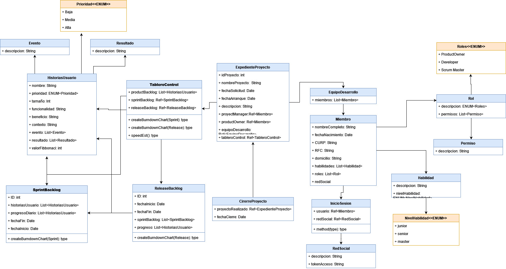

# WPparcial1

# Descripción del proyecto
Sistema diseñado para la gestión de proyectos de desarollo de software, a través de este proyecto una empresa podrá gestionar sus proyectos mediante metodologia agil SCRUM. En esta primera fase de proyecto se han agregado las rutas que se utilizaran en base a los diagramas de clases y al modelo REST.

# Diagrama de clases

# Diagrama de interacción

# Herramientas utilizadas
-Express con el modelo de vistas PUG
-Node.js

# Estructura del Proyecto
public/: Carpeta que contiene archivos estáticos como CSS, JavaScript e imágenes.
views/: Contiene los archivos Pug para las vistas, organizados por categoría.
routes/: Definición.
controllers/: Controladores para gestionar las acciones y la lógica en base al modelo REST.
app.js: Archivo principal de la aplicación que configura Express y las rutas.
package.json: Archivo de configuración de npm que lista las dependencias y scripts.

# Ejecución
-En la terminal, abrir la carpeta raiz del proyecto
-Ejecutar el comando "node start"

# Creditos

Jose Eduardo Conde Hernandez 299506
Miriam Fernanda Arellanes Perez 353256
Jesús Manuel Calleros Vázquez 348737

Proyecto realizado para la materia web platforms del Ing. Luis Antonio Ramirez